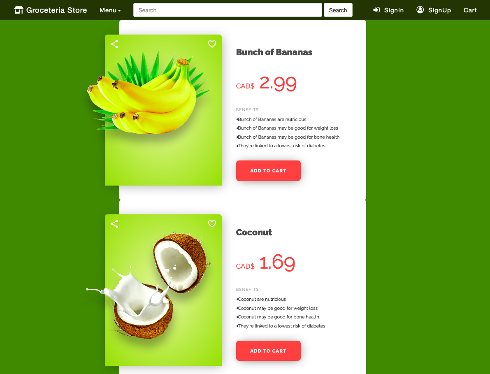

# Groceteria

A great grocery store app!

# Technologies Used
Frontend Languages: HTML, CSS, and Client-Side JavaScript
Frontend Framework: Bootstrap
Frontend Library: jQuery
Backend: Server-Side JavaScript
Backend Framework: NodeJS and NPM
Database: MySQL
Other Libraries: 
Tools: 
# System Configuration
1. Install NodeJs 
2. Install MySQL 6.2  Version
3. Install Code Editor (Recommended MS Visual Code)
4. Install NPM Packages
#### READ:
- All products
- Location of the store
- Search for products
- Category of products
- Read shopping list
- Product info

# NPM Packages
"body-parser": "^1.17.1",
"express": "^4.15.2",
"express-handlebars": "^3.0.0",
"express-passport": "^0.1.0",
"express-passport-logout": "^0.1.0",
"express-session": "^1.15.2",
"handlebars-intl": "^1.1.2",
"handlebars-paginate": "^0.1.0",
"mongodb": "^2.2.26",
"passport": "^0.3.2",
"passport-local": "^1.0.0",
"path": "^0.12.7",
"randomstring": "^1.1.5",
"uuid": "^3.0.1",
"validator": "^7.0.0",

#### CREATE:
- Add grocery list
- Admin create new product
- Submit contact us (feedback)

#### UPDATE:
- Update shopping list with new items
 
#### DELETE:
- Item from a grocery list
- Empty/delete entire list
- Admin delete product